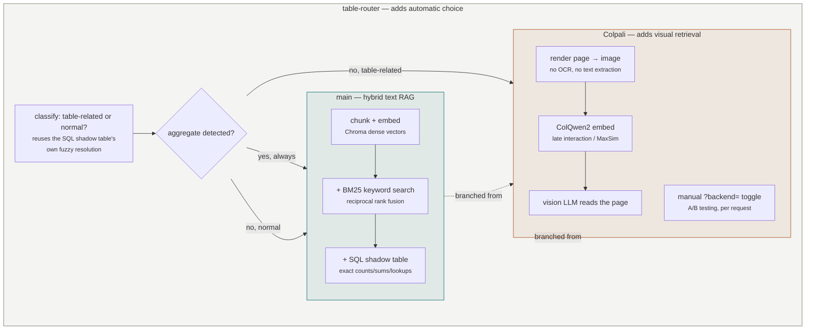
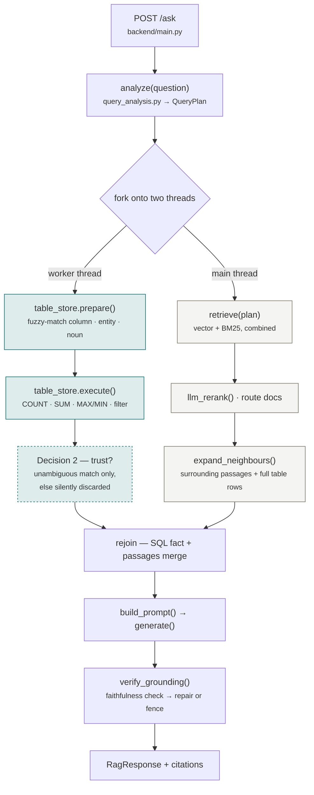
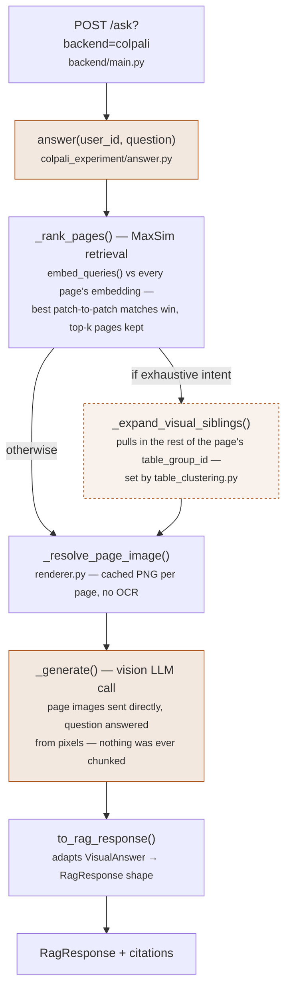
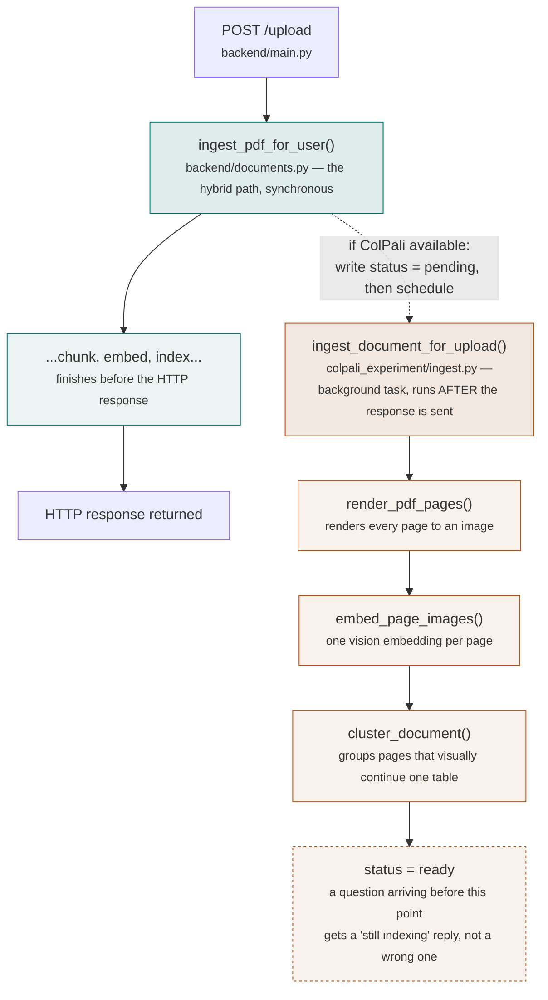
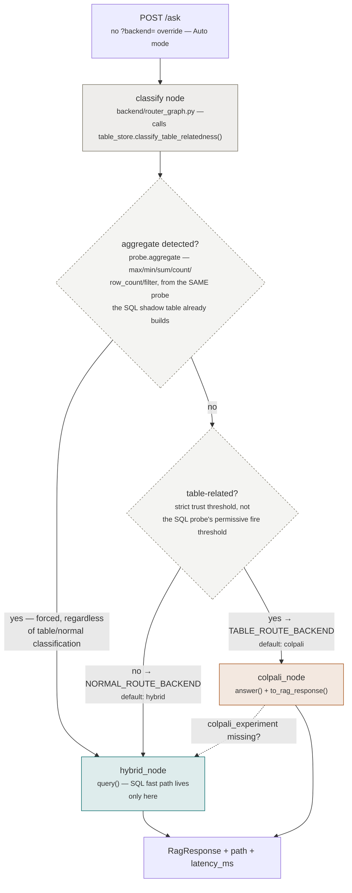

<div align="center">

# SmartDoc

**Ask plain-English questions of a library of company PDFs and get an answer
grounded in — and cited from — the actual documents, never a guess.**

_A RAG platform with three branches: a hardened hybrid text pipeline on `main`,
an isolated visual-retrieval experiment on `Colpali`, and a LangGraph router
that picks between them per question on `table-router`._


</div>

Most RAG demos stop at "chunk it, embed it, ask an LLM." SmartDoc's actual
problem is everything past that: a table cell buried in row 86 of 200 that
embeddings can't find by content, a follow-up question that needs the last
turn's context without ever letting that context be mistaken for a fact, an
answer that has to admit what it doesn't know instead of filling the gap, and
— on the newest branch — a decision about which of *two entirely different
retrieval architectures* should even answer a given question.


## At a glance

| | |
|---|---|
| **The problem** | Company PDFs — HR policies, SOPs, manuals — answered by an assistant that never fabricates. No context, no answer: a fixed refusal, never a guess. |
| **Branches** | `main` — hybrid text RAG. `Colpali` — adds an isolated visual-retrieval pipeline + a manual A/B toggle. `table-router` — adds a LangGraph classifier that picks automatically. |
| **Retrieval** | Hybrid: dense vectors (Chroma) + BM25 keyword search, reciprocal-rank fused, LLM-reranked, with hierarchical document routing. |
| **Exact values** | Every table cell is *also* flattened into SQLite as `(row, column, value)`. A permissive fire / strict trust two-decision gate resolves counts, sums, max/min, and cell lookups deterministically — never an LLM guess. |
| **Visual retrieval** (`Colpali`) | Each page rendered as an image, embedded with ColQwen2 (late interaction / MaxSim), read by a vision LLM — zero OCR, zero text extraction. Fully isolated storage. |
| **Auto routing** (`table-router`) | A LangGraph classifier judges each question table-related or normal and routes it to the configured backend — aggregation questions always forced to the SQL-capable path, regardless of that classification. |
| **Grounding** | Every claim in a generated answer is checked against the retrieved context; unsupported claims are regenerated, pruned, or fenced — never shipped silently. |
| **Isolation** | Per-user JWT auth on every endpoint but `/health`/`/auth/*`; a user's documents, sessions, and table data are invisible to every other account. |
| **Evaluation** | A 135-question scored gold set (semantic similarity + exact-value + completeness guards), re-run against every architectural change — including the router, broken down by which path answered. |


## The three branches, in one picture



**What this shows:** `main` is a complete, hardened text pipeline on its own —
everything below "Architecture (main)" describes it in full, and it never
imports anything from either other branch. `Colpali` branches from `main` and
adds a second, completely isolated retrieval architecture alongside it, with a
manual per-request switch for side-by-side comparison. `table-router` branches
from `Colpali` and adds the missing piece: a classifier that makes the choice
`Colpali`'s toggle left to the caller, while still keeping that manual override
available for A/B testing. Each branch strictly adds to the one before it —
nothing in `main`'s pipeline is modified by either later branch.


## Architecture (`main`)



Retrieval and the SQL probe run **concurrently on separate threads**, not one
after the other. The SQL check is a local indexed read (~1ms, no API call) so
firing it speculatively on any hint is free; a wrong guess costs nothing
because a second, strict pass decides whether to trust it before anything
reaches the user. Vector+keyword retrieval always runs regardless, so there is
always prose explaining the answer — SQL only ever supplies an exact value
*inside* that explanation, never a bare number with nothing around it.

Full detail — every stage, every function, the complete decision table for
when SQL is trusted — is in [`docs/BACKEND_ARCHITECTURE.md`](docs/BACKEND_ARCHITECTURE.md)
and [`DECISIONS.md`](DECISIONS.md).


## The taxonomy of "don't guess"

| Signal | What it protects against |
|---|---|
| Fixed refusal string | No context found → `"I don't know based on the available documents."`, never a plausible-sounding fabrication. |
| Grounding verification | Every claim in a generated answer is checked against the retrieved passages *after* generation; unsupported claims are regenerated once, then pruned or fenced if still unsupported — never shipped unmarked. |
| Two-decision SQL gate | Decision 1 (fire?) is permissive — a fuzzy hint is enough, it costs nothing. Decision 2 (trust?) is strict — entity **and** column both score ≥85, exactly one row resolves, no multi-answer cue. Anything short of that is discarded silently and the passages answer alone. |
| Identifier pinning | `WRatio("employee 45", "employee 1")` scores ~95 — comfortably over a naive fuzzy threshold — so identifiers are matched on **exact digit runs**, never edit distance alone, or row 45's question would confidently answer with row 1's data. |
| Manifest-backed completeness | A document's table of contents (built at ingest) knows a section lists 7 items; an answer naming 3 is caught and regenerated rather than looking finished. |


## `Colpali` branch: visual retrieval as a second pipeline

Adds `colpali_experiment/` as a second, complete retrieval architecture that
answers the same `/ask` endpoint the hybrid pipeline does — same request
shape, same `RagResponse` shape out, radically different mechanics in
between. **Isolation is real, not conceptual**: separate storage
(`colpali_store.db`, its own SQLite file, plus `page_images/` on disk),
separate code path (nothing in `colpali_experiment/` imports `backend.rag`,
and nothing in the hybrid pipeline imports back), so the two can run side by
side without either one able to corrupt the other's index.

### How ColPali reads a page

Each PDF page is rendered to an image (PyMuPDF, no OCR) and embedded with
**ColQwen2**, a vision model that — unlike a normal embedding model — produces
one vector *per patch of the image* instead of one vector for the whole page.
This is called **late interaction**. A question is embedded the same way and
scored against every page by taking each question-patch's single best match
among the page's patches, then summing those best-match scores — a method
called **MaxSim**. The pages with the highest MaxSim score are handed to a
vision LLM, which reads the actual pixels — nothing was ever chunked, so
nothing about the page's layout was ever lost translating it to text first.



**What this shows:** one straight line, no fork — unlike the hybrid pipeline's
concurrent SQL-probe/retrieval split above, ColPali's retrieval unit is a
whole page image, so there's nothing to run in parallel. The only branch is
sibling expansion: it fires only when the question reads as exhaustive
("how many…", "list all…") *and* the top-ranked page belongs to a known
visual table group — a page-continuity cluster built at ingest from pure
pixel similarity between consecutive pages (matching header rows, matching
column grids), with **no text extraction or PDF table-detection involved at
all**. Both signals are required deliberately: gating on the table-group
alone was tried and measured to over-expand a plain single-fact lookup to
every page of a large table document, and gating on question-intent alone
would miss it entirely — the combination is what satisfies both directions.

### Upload: two ingestion paths from one request



The hybrid path (teal) is what the HTTP response waits on — a document is
immediately queryable by hybrid the moment `/upload` returns. ColPali's
embedding + clustering (amber) is scheduled as a `BackgroundTasks` job that
runs *after* that response is sent, so a caller is never held up by its
heavier per-page vision inference. A `pending` status is written
**synchronously, before the response returns** — closing a real race:
without it, a question arriving in the gap between upload and background
completion would get a bare wrong refusal ("the documents don't cover
this") instead of an honest "still indexing" reply, indistinguishable from a
genuine miss. Found by testing that exact scenario, not assumed.

### Session memory, per backend

A conversation's running summary is used differently depending on which
backend answers a turn — see the "Chat history" diagram in
[`docs/BACKEND_ARCHITECTURE.md`](docs/BACKEND_ARCHITECTURE.md#02--chat-history-how-a-conversation-remembers-itself):
the hybrid backend folds the summary into its generation prompt (labeled
explicitly as reference-resolution only, never a fact source); ColPali
receives no summary at all. Either way, every turn is stored and the summary
is rewritten identically in the background — a session switched hybrid →
ColPali → hybrid mid-conversation keeps one continuous, gap-free history.

### What each path stores

| Hybrid | ColPali |
|---|---|
| `chroma_store/` — dense vector chunks | `colpali_store.db` → `colpali_page_embeddings` — one multi-vector embedding per page |
| `smartdoc.db` → `table_cells` — every table cell, flattened | `colpali_store.db` → `colpali_ingest_status`, table-group ids |
| `smartdoc.db` → documents, sessions, manifests | `page_images/` — rendered PNG cache, disk only |

### Measured: the full gold-set comparison

Both backends were run against the **identical** 115-question gold set,
scored by the same similarity + exact-match + completeness pipeline — so
these numbers are directly comparable, not two different measurements
dressed up as one.

| | hybrid | colpali |
|---|---|---|
| Overall pass rate | **92.2%** (106/115) | **87.8%** (101/115) |
| Mean similarity | 0.8403 | 0.8434 |
| Mean latency/query | 6776 ms | 4233 ms |
| Mean cost/query | $0.000565 | $0.016621 |

Two hypotheses were stated up front and tested, not fitted after the fact:

- **"Hybrid's SQL-backed exact lookup beats ColPali on numeric/table-cell
  questions."** *Did not hold* — `table_cell_lookup` was a dead heat (100% vs
  100%), and ColPali actually led `numeric_quantitative` by +5.6pp.
- **"ColPali beats hybrid on layout/table-heavy questions."** *Did not hold*,
  and the `comparison` category went sharply the other way (hybrid 100% vs
  colpali **0%**) — root-caused, not just observed: every one of ColPali's
  failures there had the *right content* (mean similarity 0.75, comparable to
  categories it passed) but answered in prose instead of a markdown table,
  because its single system prompt has no per-question-type formatting rule
  the way the hybrid pipeline's `_TYPE_RULES[COMPARISON]` does. A prompt gap
  in this experiment, not a retrieval-architecture finding.
- `table_aggregation` genuinely favored ColPali as hypothesized (+40pp), and
  a separate, real limitation was found independently: asking a vision model
  to precisely tally one status value across ~200 dense rows spread over six
  image-heavy pages is a known weakness against exact text-based counting —
  reported as a finding, not patched around with a prompt trick.

Full numbers, every category, and the intent-classifier asymmetry the brief
explicitly asked for are in
[`docs/COLPALI_EXPERIMENT.md`](docs/COLPALI_EXPERIMENT.md), and the same
comparison renders live on the `/evaluation` page's "ColPali vs Hybrid" tab.

```bash
git checkout Colpali
uvicorn backend.main:app --reload
# ask via the manual toggle
curl -s -X POST "localhost:8000/ask?backend=colpali" \
  -H "Authorization: Bearer $TOKEN" -H "Content-Type: application/json" \
  -d '{"question":"What tier is Northwind Logistics?"}'
```


## `table-router` branch: choosing the backend automatically

`Colpali`'s toggle is manual — a caller has to already know which pipeline
suits a question before asking. `table-router` adds a small
[LangGraph](https://github.com/langchain-ai/langgraph) state graph
(`backend/router_graph.py`) that decides itself, wrapping both existing
pipelines as graph nodes rather than reimplementing either, and makes
**Auto** the new default for `/ask`. The manual `?backend=` override still
bypasses routing entirely, unchanged, so direct A/B testing stays available.



**What this shows:** the classifier runs first and answers two independent
questions from one fuzzy match against the user's table vocabulary. First:
does this look like an aggregate — a count, sum, max/min, or filtered list?
If so, the question is forced to the hybrid node no matter what, because
ColPali has no SQL layer at all — sending an aggregate there would silently
lose the exact answer. Otherwise: is the question about something that
actually lives in a table? That decides which of the two *configured*
backends answers. Either one, `TABLE_ROUTE_BACKEND` / `NORMAL_ROUTE_BACKEND`,
can be repointed at the other pipeline in `.env` with no code change, since
the conditional edge reads them fresh on every request rather than baking
the destination into the graph at build time. A missing `colpali_experiment`
dependency degrades the same way the old manual override already did — fall
back to hybrid rather than crash the request.

### Reusing Decision 1's resolution, not a second classifier

`classify_table_relatedness()` calls the exact same fuzzy entity/column
matcher `table_store.prepare()` already builds for the SQL probe (factored
out into a shared internal function so it runs independent of
`PARALLEL_SQL_LOOKUP_ENABLED` — routing to ColPali is a separate concern from
executing the SQL fast path). It does **not** reuse the probe's own
threshold, though: the probe can afford to be permissive because a second,
strict pass vetoes a bad match before it's ever stated as fact — the router
has no such second gate, so a bad match here sends the *whole question* to
the wrong pipeline, not just a discarded guess.

**Found by testing, not assumed.** "What is the process for requesting
remote work?" fuzzy-matched the word *"work"* against a stored fault-code
entity (*"network link lost"*) at a score that cleared even the router's
stricter floor — a known quirk of the fuzzy-matching library's
partial-ratio scoring on short query spans, the mirror image of a failure
mode the SQL shadow table's own matcher already guards against for short
*candidates*. Fixed with a scoped guard inside the classifier only; the SQL
shadow table's own resolution behavior for Decision 1/Decision 2 is
untouched.

Every response — Auto mode or manual override alike — carries `path`
(`table_colpali` / `normal_hybrid` / `sql_aggregation`) and `latency_ms`,
sourced from the router's own end-to-end timer rather than a client-side
stopwatch, so the chat UI can show "Answered via: ColPali · 4.2s" and the
evaluation report below can break results down by path using one consistent
vocabulary regardless of how the answer was produced.

### Measured: full evaluation against the routed setup

135 questions — the existing 115-question gold set plus 20 new table-heavy
questions written against a real IT asset register (180 rows) and an
employee handbook — run end to end in Auto mode:

| | overall | table_colpali | normal_hybrid | sql_aggregation |
|---|---|---|---|---|
| Pass rate | **88.1%** (119/135) | 88.2% (45/51) | 87.5% (56/64) | 85.7% (12/14) |
| Mean latency | 9072 ms | 6712 ms | 11041 ms | 12487 ms |

**A real, pre-existing gap this run surfaced, left unfixed on instruction.**
Several "how many X are Y" questions (e.g. *"How many assets are currently
Under Repair?"*) classified correctly as an aggregate at Decision 1, but
Decision 2 — inside the SQL shadow table itself, unrelated to the router —
rejected the row-count: a wide, low-confidence entity-type span match
(*"assets are currently under"* → *"Asset ID"*) claimed word-territory that
would otherwise have let the value-filter path resolve *"Under Repair"* as a
known `status` column value. The question then fell through to an ordinary
hybrid or ColPali answer, which guessed the count from partial context and
got it wrong. This is a pre-existing SQL-aggregation classification gap that
predates this branch, not a router bug — the router correctly forced every
one of these questions to the one pipeline that *could* have answered them
exactly; whether that pipeline's own SQL layer actually resolves the
aggregate is a separate, already-existing limitation.

Full writeup is in
[`docs/BACKEND_ARCHITECTURE.md`](docs/BACKEND_ARCHITECTURE.md#04b--table-router-branch-choosing-the-backend-automatically).

```bash
git checkout table-router
uvicorn backend.main:app --reload
# Auto mode — no backend param at all
curl -s -X POST localhost:8000/ask \
  -H "Authorization: Bearer $TOKEN" -H "Content-Type: application/json" \
  -d '{"question":"How many assets are Under Repair?"}'
# -> path: "sql_aggregation", answered by the exact SQL count, not a guess

# repoint a branch's destination without touching code
echo "TABLE_ROUTE_BACKEND=hybrid" >> .env   # table questions now answer via hybrid too
```


## Setup

```bash
git clone https://github.com/shahbhavya7/SmartDoc.git smartdoc
cd smartdoc
git checkout main            # or Colpali / table-router — see above

python3 -m venv .venv
source .venv/bin/activate    # Windows: .venv\Scripts\activate
pip install -r requirements.txt

cp .env.example .env         # then add your real OPENAI_API_KEY
```

Configuration lives entirely in `.env`; see `.env.example` for the full list
(chunking, retrieval, every feature flag below). Never commit `.env` — the
default `JWT_SECRET` is a published placeholder, and startup refuses to run
with it unless `ALLOW_INSECURE_JWT_SECRET=true`.

Create the development account and adopt the existing corpus into it:

```bash
python -m scripts.seed_dev_user
```

```bash
./run.sh                       # backend :8000 + frontend :3000, together
# first time only:
(cd web && npm install)
```

| | |
|---|---|
| App | <http://localhost:3000> |
| API docs | <http://127.0.0.1:8000/docs> |
| Dev login | `dev@smartdoc.local` / `devpassword123` |

`./run.sh --backend-only` / `--ui-only` run either half alone;
`API_PORT=8001 UI_PORT=3001 ./run.sh` runs a second instance alongside the
first (also update `CORS_ALLOW_ORIGINS` for a non-default UI port — the API
allows a named list of browser origins, so an unlisted one is blocked by the
browser before the request ever reaches the server).


## Try it

- **Ask a question:** *Chat* → type a question about an uploaded PDF. The
  answer streams back with structured citations (document, page, snippet)
  underneath it, or the fixed refusal if nothing in your documents covers it.
- **Ask a follow-up:** the same session's running summary resolves "and the
  Executive band?" without re-stating the whole question — see
  [Chat sessions and memory](#chat-sessions-and-memory) below.
- **Ask for an exact number:** "how many vendors are Tier 3?" — the SQL
  shadow table (`main`) or the router's forced aggregate path
  (`table-router`) answers with a genuine COUNT, not an LLM estimate.
- **Compare backends side by side** (`Colpali`/`table-router`): flip the
  chat UI's Hybrid/ColPali/Auto toggle, or `curl` the same question with
  `?backend=hybrid` and `?backend=colpali`.
- **Run the eval suite:**
  ```bash
  python -m eval.eval_tool.run_eval --skip-consistency-wait
  ```
  Scores every answer by semantic similarity + an exact-value guard for
  numeric/table categories + completeness for enumerations, against a
  135-question gold set. `table-router`'s run additionally breaks the report
  down by which path answered.


## Chat sessions and memory

`POST /ask` is stateless unless you pass a `session_id` from `POST /sessions`.
A session's running summary resolves references ("that policy", "the same
band") in the **generation** prompt only — it is never treated as a source of
fact, and it is rewritten by a background task *after* the response is
already sent, so summarizing never adds latency to the turn that triggered it.

```bash
TOKEN=...  # from POST /auth/login
SESSION=$(curl -s -X POST localhost:8000/sessions \
  -H "Authorization: Bearer $TOKEN" -H 'Content-Type: application/json' \
  -d '{"title":"leave questions"}' | python3 -c "import sys,json;print(json.load(sys.stdin)['id'])")

curl -s -X POST localhost:8000/ask -H "Authorization: Bearer $TOKEN" \
  -H 'Content-Type: application/json' \
  -d "{\"question\":\"How many days of annual leave do Standard band employees get?\",\"session_id\":\"$SESSION\"}"

curl -s -X POST localhost:8000/ask -H "Authorization: Bearer $TOKEN" \
  -H 'Content-Type: application/json' \
  -d "{\"question\":\"And the Executive band?\",\"session_id\":\"$SESSION\"}"
```


## Security & isolation

- **No SQL injection** — the SQL shadow table is read with parameterized
  queries only; the router's/probe's generated conditions never interpolate
  raw question text into SQL.
- **Per-user isolation on every store** — Chroma reads, the SQL shadow table,
  ColPali's page embeddings, sessions, and messages are all filtered by the
  signed-in user's id server-side; no endpoint accepts a user id as a
  parameter for the client to spoof.
- **Auth** — bcrypt-hashed passwords + JWT, Google OAuth via authlib. A
  present-but-blank `JWT_SECRET` resolves to the same insecure placeholder as
  an absent one (deliberately, so it can't be silently weaker than the
  documented failure mode) and startup refuses to run with it unless
  explicitly allowed.
- **Upload hardening** — filenames are reduced to a sanitized basename
  (defeats path traversal), only `.pdf` is accepted, uploads are read in
  bounded chunks against a hard size cap.
- **Graceful degradation, everywhere** — a bad/missing OpenAI key returns a
  clean 502, never a crash; a missing optional dependency (`colpali-engine`,
  `torch`) degrades only the ColPali/router paths, never the hybrid pipeline;
  every error response shares one shape, `{"error": {"type", "message"}}`.


## Feature flags (`main`)

Every tunable lives in `.env` (see `.env.example` for the full, current list).
The ones worth knowing up front:

| Flag | Default | Effect |
|---|---|---|
| `PARALLEL_SQL_LOOKUP_ENABLED` | `false` | The exact-value SQL shadow table (Addendum 2) — see "The taxonomy of don't guess" above. |
| `MARKDOWN_INGESTION_ENABLED` | `false` | Convert each PDF to markdown before chunking, split on real heading boundaries instead of a fixed character count. |
| `TABLE_AWARE_INGESTION_ENABLED` | `false` | Extract tables as structured objects, stitch multi-page tables at ingest, chunk on row boundaries with the header repeated in every part. |
| `ANSWER_VOICE_ENABLED` / `ANSWER_FORMAT_ENABLED` | `true` | Prompt-side only — a warm register and content-shaped structure (tables for comparisons, bullets for steps). Cannot move a figure or a citation. |
| `ENABLE_GROUNDING_CHECK` / `ENABLE_GROUNDING_REPAIR` | `true` | The faithfulness verification pass and its regenerate/prune/fence remediation. |

`table-router` adds `TABLE_ROUTE_BACKEND` / `NORMAL_ROUTE_BACKEND` (see above);
`Colpali` adds `RETRIEVAL_BACKEND`.


## Project structure

```
smartdoc/
├── backend/                 # FastAPI app + the hybrid RAG pipeline
│   ├── main.py                #   HTTP layer only — no retrieval/generation logic itself
│   ├── rag.py                  #   the orchestrator: analyze → retrieve → assemble → generate → verify
│   ├── query_analysis.py       #   classifies each question into one of seven intent types
│   ├── retrieval.py             #   dense + BM25 fusion, reranking, document routing
│   ├── table_store.py           #   the SQL shadow table + Decision 1/2 exact-value engine
│   ├── router_graph.py          #   table-router branch only — the LangGraph classifier
│   ├── auth.py / user_scope.py  #   JWT + bcrypt, per-request user scoping
│   └── memory.py                #   session summaries, background-updated
├── colpali_experiment/       # Colpali/table-router branches only — isolated visual pipeline
├── web/                      # Next.js frontend (App Router, TypeScript, Tailwind, shadcn/ui)
├── streamlit_demo/           # a second, independent HTTP client of the same API
├── eval/                     # gold set + scoring harness (git-ignored; see below)
├── docs/                     # architecture dossiers, decision log (git-ignored; see below)
├── scripts/                  # seeding, verification, evaluation CLIs (git-ignored; see below)
├── tests/                    # pytest suite, 348 tests (git-ignored; see below)
├── requirements.txt
└── README.md  DECISIONS.md
```

> **A note on what's git-ignored.** `eval/`, `docs/`, `scripts/`, and `tests/`
> are currently excluded by `.gitignore` on every branch — they exist on disk
> and are referenced throughout this README, but are not part of what a fresh
> `git clone` brings down. This is a known, pre-existing gap in the repo's
> ignore rules, not a statement that these directories don't matter.


## Documentation

| Document | What it covers |
|---|---|
| [`docs/BACKEND_ARCHITECTURE.md`](docs/BACKEND_ARCHITECTURE.md) | The hybrid and ColPali pipelines end to end, with flow diagrams — plus the `table-router` classifier's own section. |
| [`docs/COLPALI_EXPERIMENT.md`](docs/COLPALI_EXPERIMENT.md) | The visual-retrieval branch in full: model choice, table-continuity clustering, the full gold-set comparison and both stated hypotheses. |
| [`docs/v2-pipeline-dossier.md`](docs/v2-pipeline-dossier.md) | All 21 stages of the `main` pipeline — identity, scoping, ingestion, query, session memory, API, frontend. |
| [`docs/evaluation-guide.md`](docs/evaluation-guide.md) | How the scoring pipeline works, and how to read a report. |
| [`DECISIONS.md`](DECISIONS.md) | Why each architectural decision was made, including what was measured and rejected. |


## Command reference

Run these from the project root with your virtualenv active.

### Running

| Command | What it does |
|---|---|
| `./run.sh` | Backend `:8000` + frontend `:3000` together, waits for `/health` before starting the UI, stops both on `Ctrl-C`. |
| `./run.sh --backend-only` | API only. |
| `./run.sh --ui-only` | UI only, against an API already running. |
| `.venv/bin/python -m uvicorn backend.main:app --reload` | Backend by hand. |
| `cd web && npm run dev` | Frontend by hand (after `npm install` once, and `cp .env.example .env.local`). |
| `uvicorn backend.main:app --port 8000` + `streamlit run streamlit_demo/app.py` | The independent Streamlit demo client (needs `python scripts/mint_demo_token.py` first). |

### Quality checks

| Command | What it does |
|---|---|
| `python -m pytest tests/ -q` | The full suite. |
| `python -m pytest tests/test_addendum2_sql_lookup.py -q` | Just the SQL shadow table's own tests. |
| `python scripts/verify_addendum2.py --structural` | 20 structural checks on the exact-value engine, no API calls. |
| `python scripts/verify_v3_2.py` / `verify_v3_3.py` | Table-aware ingestion / universal metadata, structural + live. |

### Evaluation

| Command | What it does |
|---|---|
| `python -m eval.eval_tool.run_eval --skip-consistency-wait` | Run the full gold set against the live API. |
| `python -m eval.eval_tool.run_eval --categories table_cell_lookup,table_aggregation` | A category subset. |
| `python -m eval.eval_tool.run_comparison --latest` (`Colpali`/`table-router`) | Build the hybrid-vs-ColPali comparison report from the two most recent tagged runs. |

### Accounts & data

| Command | What it does |
|---|---|
| `python -m scripts.seed_dev_user` | Create the dev account and adopt the existing corpus into it. |
| `python scripts/mint_demo_token.py` | Mint a local-only bearer token for the Streamlit demo's pre-configured account. |
| `python scripts/measure_memory_latency.py` | Confirm background summarization adds zero latency to `/ask`. |

### When something's wrong

| Symptom | Fix |
|---|---|
| `/ask` returns a 502 | `OPENAI_API_KEY` missing or invalid in `.env` — everything except generation still works. |
| ColPali routes crash on startup | The optional `colpali-engine`/`torch` dependency isn't installed — the hybrid pipeline is unaffected; `/colpali/*` and any `?backend=colpali` request fall back cleanly. |
| A non-default UI port can't reach the API | Add it to `CORS_ALLOW_ORIGINS` in `.env` — the browser blocks an unlisted origin before the request is sent. |
| `bad interpreter` running a `.venv/bin/*` console script | The venv was created at a different path. Invoke tools via `.venv/bin/python -m <module>` instead of the stale shim. |

<div align="center">

**main** = hybrid text RAG · **Colpali** = + isolated visual retrieval · **table-router** = + automatic per-question routing

</div>

---

*Last updated: July 2026*